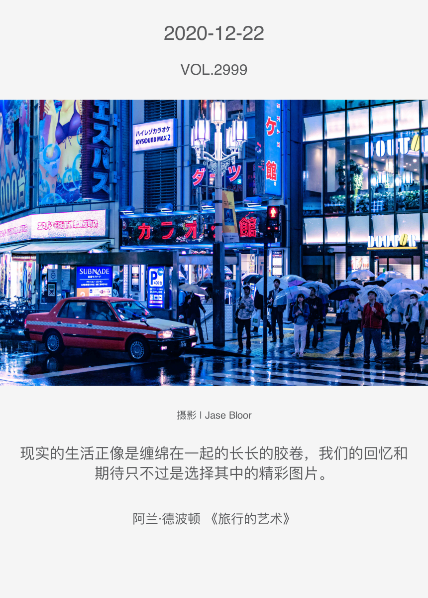

## ONE 2020 Daily Graphic Archive



### Introduction

The graphical information for each day of 2020 is captured using the http client provided by Node, and the request headers and parameters captured by the APP network request debugging. The captured information is stored as a json file in the `data/json` directory.

The canvas-node library is used to read the json data, typeset the images and text, and generate the images and output them to the `data/images` directory.

### How to use

```sh
# Grabbing json information
npm run spider 

# Read json files and generate images to save
npm run start

```

### Important note

This project is for learning purposes only and should not be used for other commercial purposes.

